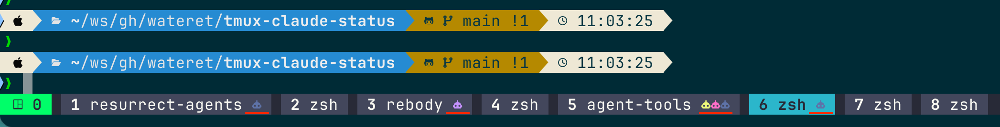

# tmux-claude-status

Shows a colored Claude Code icon in the tmux status bar for each window running an active Claude session — color indicates the session state.



*Screenshot uses the [Nerd Font](https://www.nerdfonts.com/) icon `nf-md-robot` (`󰚩`). The default icon is `C`.*

| Color | State |
|-------|-------|
| Pink | busy |
| Purple | running shell command |
| Yellow | waiting for input |
| Blue/dim | idle |

## Install

**Via [TPM](https://github.com/tmux-plugins/tpm):**

```
set -g @plugin 'wateret/tmux-claude-status'
```

Then press `prefix + I` to install.

**Manual:**

```bash
git clone https://github.com/wateret/tmux-claude-status ~/.tmux/plugins/tmux-claude-status
~/.tmux/plugins/tmux-claude-status/tmux-claude-status.tmux
```

## Usage

Add `#{claude_status}` to your `window-status-format` in `tmux.conf`:

```
set -g window-status-format "... #{claude_status} "
set -g window-status-current-format "... #{claude_status} "
```

The plugin replaces `#{claude_status}` with the actual status call on load.

If your terminal uses a [Nerd Font](https://www.nerdfonts.com/), add this alongside your format strings:

```
set -g window-status-format "... #{claude_status} "
set -g window-status-current-format "... #{claude_status} "

set -g @claude_status_icon '●' # Choose an icon you like
```

## Configuration

All options are set via `set -g` in `tmux.conf`:

| Option | Default | Description |
|--------|---------|-------------|
| `@claude_status_icon` | `C` | Icon to display |
| `@claude_status_color_busy` | `#ff79c6` | Color when busy |
| `@claude_status_color_waiting` | `#f1fa8c` | Color when waiting for input |
| `@claude_status_color_shell` | `#bd93f9` | Color when running shell command |
| `@claude_status_color_idle` | `#6272a4` | Color when idle |
| `@claude_status_cache_ttl` | `5` | Cache TTL in seconds |

